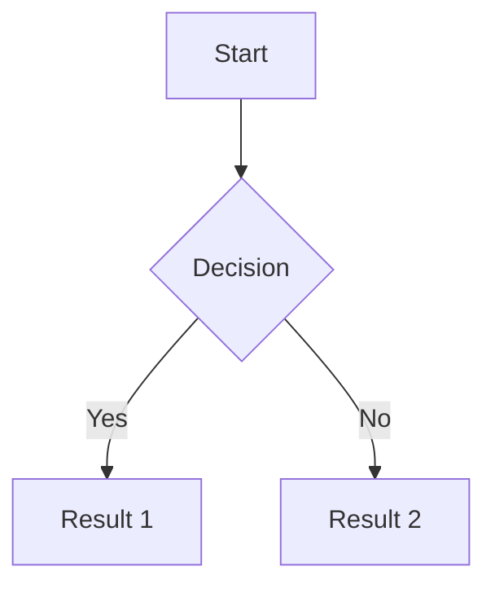
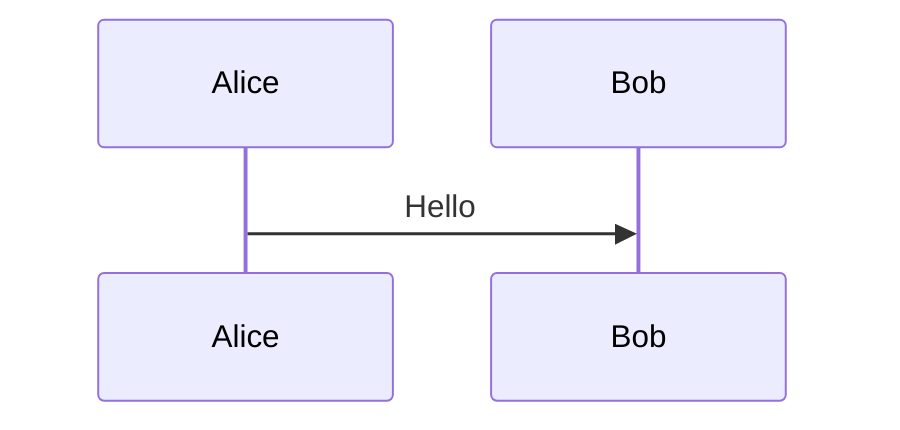

# Creating Slidev Presentations

## When to Use
- Creating a new slide deck with Slidev (sli.dev)
- Adding a presentation to an existing project

## When NOT to Use
- Deck must remain in Keynote, PowerPoint, or Google Slides
- User wants a different slide framework (reveal.js, Marp)

## Inputs the Agent Should Ask For (only if missing)
- Presentation topic/name (used for the filename)
- Presentation goal, audience, and duration

## Outputs / Definition of Done
- `presentation/<topic>.md` created with valid Slidev structure
- Deck runs locally via `bun slidev presentation/<topic>.md`
- Deck uses ReLens visual style

## Procedure

### 1. Ensure Slidev CLI is installed locally

Check if `@slidev/cli` is in the project's dependencies:

```bash
grep -q '"@slidev/cli"' package.json && echo "installed" || echo "not installed"
```

If not installed, add it with Bun:

```bash
bun add -D @slidev/cli @slidev/theme-default
```

### 2. Create the presentation folder

If `presentation/` doesn't exist, create it:

```bash
mkdir -p presentation
```

### 3. Create the presentation file

Name the file after the topic. For example, if the topic is "birds", create `presentation/birds.md`.

Use this minimal structure:

```md
---
title: "<Topic Title>"
theme: default
---

# <Topic Title>

<Content goes here>
```

### 4. Apply ReLens visual style

Follow the ReLens palette from `references/relens-style.md`:
- Background: `#fff4dc` (warm cream)
- Primary: `#fe8630` (orange for accents)
- Secondary: `#000000` (black text)
- Use MonteCarlo font for emphasized words in titles
- Keep text minimal on each slide

### 5. Run the presentation

```bash
bun slidev presentation/<topic>.md
```

## Mermaid Diagrams

Mermaid is built-in to Slidev. Use fenced code blocks with `mermaid` language:

~~~md

~~~

### Custom Mermaid Theme (optional)

To customize Mermaid appearance, create `setup/mermaid.ts`:

```typescript
import { defineMermaidSetup } from '@slidev/types'

export default defineMermaidSetup(() => {
  return {
    theme: 'neutral',
  }
})
```

### Per-diagram Options

Pass options inline for individual diagrams:

~~~md

~~~

## Available Styles

Currently only one style is available:

| Style | Reference |
|-------|-----------|
| ReLens | `references/relens-style.md` |

## Checks & Guardrails
- File is created in `presentation/` folder
- Filename matches the topic (e.g., `birds.md` for a birds presentation)
- Uses local CLI via Bun (never `npx`)
- Slide separators `---` are used correctly
- Keep slide content concise

## References
- `references/relens-style.md`
